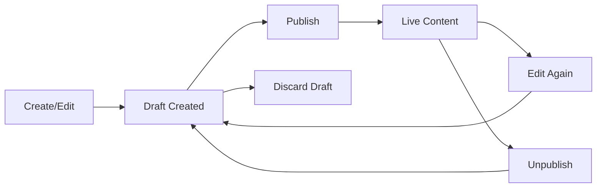

# Sanity MCP (Model Context Protocol) Guide

## Overview

The Sanity MCP server enables AI assistants like Claude to interact directly with your Sanity projects, providing both editorial and development-focused capabilities for content operations, schema management, GROQ queries, and project administration.

**Official Documentation:** [https://mcp.sanity.io](https://mcp.sanity.io)
**Revision History:** [https://mcp.sanity.io/changelog](https://mcp.sanity.io/changelog)

## What Can You Do With Sanity MCP?

Use natural language to perform Sanity operations:

- **Content Management:** Create, update, publish, and query documents
- **Schema Operations:** Deploy schemas, explore types, and manage workspaces
- **GROQ Queries:** Execute queries to find and filter content
- **Project Management:** Create projects, datasets, and manage CORS settings
- **Migrations:** Get guidance for migrating from other CMS platforms
- **Releases:** Manage content releases and scheduled publishing
- **AI Features:** Generate and transform images with AI
- **Documentation:** Search and read Sanity documentation

## Installation & Setup

### Option 1: Quick Install via Sanity CLI (Recommended)

```bash
npx sanity@latest mcp configure
```

Select your code editor (VS Code, Cursor, etc.) with the spacebar and press Enter. The CLI will:
- Generate an authentication token
- Update your editor's MCP configuration automatically
- Set up the connection

### Option 2: Manual Configuration

Add to your editor's MCP configuration:

**VS Code/Cursor:**
```json
{
  "mcpServers": {
    "sanity": {
      "command": "npx",
      "args": ["-y", "@sanity/mcp-server@latest"],
      "env": {
        "SANITY_API_TOKEN": "your-token-here"
      }
    }
  }
}
```

**Get your token:** [https://sanity.io/manage/personal/tokens](https://sanity.io/manage/personal/tokens)

## Roles and Permissions

### Required Permissions

Access to MCP tools depends on your Sanity project role:

| Tool Category | Required Role | Notes |
|--------------|---------------|-------|
| **Read Operations** | Viewer or higher | Query documents, read schemas, list resources |
| **Create/Edit Content** | Editor or higher | Create drafts, patch documents |
| **Publishing** | Editor or higher | Publish/unpublish documents |
| **Schema Deployment** | Administrator | Deploy schema changes |
| **Project Management** | Administrator | Create projects, datasets, manage CORS |
| **Dataset Management** | Administrator | Create/modify datasets |
| **Release Management** | Editor or higher | Create and manage releases |

### Managing Team Permissions

1. Go to [https://sanity.io/manage](https://sanity.io/manage)
2. Select your project
3. Navigate to **Members** tab
4. Assign appropriate roles:
   - **Administrator:** Full access to all MCP tools
   - **Editor:** Content and release management
   - **Viewer:** Read-only access

## Available Tools Reference

### Context & Schema Tools

#### `get_context`
Get project-specific context including schemas, releases, and embeddings.

```
Get context for my project
```

#### `get_schema`
Retrieve the full schema for a workspace or specific type.

```
Show me the schema for the "post" document type
```

#### `list_workspace_schemas`
List all available workspace schema names.

```
What schemas are available in this workspace?
```

#### `get_groq_specification`
Get GROQ language specification and syntax help.

```
How do I filter documents in GROQ?
```

### Schema Management

#### `deploy_schema`
Deploy schema types directly to the cloud.

**⚠️ Important:** Only use for projects WITHOUT a local Sanity Studio. If you have local schema files, modify those instead.

```
Deploy this schema type to production dataset
```

### Document Operations

#### `create_document_from_json`
Create a new draft document with JSON content.

```json
Create a new post document with this data: {
  "title": "My Post",
  "slug": {"current": "my-post"},
  "publishedAt": "2025-01-15"
}
```

#### `create_document_from_markdown`
Create a draft document from Markdown content.

```
Create a blog post from this markdown:
# My Post Title
This is the content...
```

#### `patch_document`
Make precise field-level modifications to documents.

```
Update the title of document "post-123" to "New Title"
```

**Key behaviors:**
- Patching a published document creates/updates a draft
- Patching a draft updates it in place
- Changes must be published separately to go live

#### `query_documents`
Execute GROQ queries to find and filter content.

```
Find all published blog posts by author "Jane Doe"
```

**Perspectives:**
- `raw` - All documents (drafts and published)
- `published` - Only published documents
- `drafts` - Only draft documents
- `[releaseId]` - Documents in a specific release

#### `get_document`
Fetch a single document by its exact ID.

```
Get document with ID "post-123"
```

### Publishing Workflow

#### `publish_documents`
Publish one or more draft documents.

```
Publish the draft for "post-123"
```

#### `unpublish_documents`
Move published documents back to draft state.

```
Unpublish document "post-123"
```

#### `discard_drafts`
Permanently delete draft documents.

```
Discard the draft for "post-123"
```

**⚠️ Important:** This is also used for complete document deletion:
1. For published docs: Unpublish first, then discard
2. For drafts: Discard directly

### Release Management

#### `list_releases`
List content releases, filtered by state.

```
Show me all active releases
```

States: `active`, `scheduled`, `published`, `archived`, `deleted`, `all`

#### `create_release`
Create a new content release.

```
Create a release named "Spring 2025 Launch" scheduled for April 1st
```

#### `schedule_release`
Schedule a release for automatic publishing.

```
Schedule release "spring-launch" for March 15, 2025 at 9am PST
```

#### `publish_release`
Publish a release immediately.

```
Publish the "spring-launch" release now
```

#### `create_version`
Create document versions for a specific release.

```
Create a version of "post-123" for release "spring-launch"
```

### Project & Resource Management

#### `list_projects`
List all Sanity projects you have access to.

```
Show me all my Sanity projects
```

#### `create_project`
Create a new Sanity project with dataset.

```
Create a new project called "My Blog" with a production dataset
```

#### `list_datasets`
List all datasets in a project.

```
What datasets exist in this project?
```

#### `create_dataset`
Create a new dataset.

```
Create a staging dataset in this project
```

#### `add_cors_origin`
Add CORS origins for client-side access.

```
Add https://my-website.com to CORS origins
```

### AI Image Tools

#### `generate_image`
Generate a new image with AI for a document field.

```
Generate an image for the hero field showing "a sunset over mountains"
```

**Note:** Image generation is asynchronous and completes in the background.

#### `transform_image`
Transform an existing image with AI.

```
Transform the hero image to have warmer colors and sunset lighting
```

### Search & Discovery

#### `semantic_search`
Perform semantic searches using embeddings.

```
Find documents semantically similar to "product launch strategies"
```

#### `search_docs`
Search Sanity documentation.

```
Search docs for "portable text rendering"
```

#### `read_docs`
Read a specific documentation article.

```
Read the docs at /docs/groq/functions
```

### Migration & Best Practices

#### `migration_guide`
Get migration guides from other CMS platforms.

Available guides:
- General migration overview
- Schema migration (generic, Contentful, WordPress, Strapi, Drupal)
- Content migration (generic, Contentful, WordPress, Strapi)

```
Show me how to migrate from WordPress to Sanity
```

#### `list_sanity_rules`
List available development best-practice rules.

```
What Sanity best practice rules are available?
```

#### `get_sanity_rules`
Load specific best-practice rules.

```
Load the Next.js and GROQ best practice rules
```

**Available rules:** `sanity-nextjs`, `sanity-groq`, `sanity-schema`, `sanity-visual-editing`, etc.

## Usage Examples

### Creating and Publishing Content

```
1. "Create a blog post titled 'Getting Started with Sanity' with the slug 'getting-started'"
2. "Add a featured image to post 'getting-started'"
3. "Set the author to 'john-doe' for post 'getting-started'"
4. "Publish post 'getting-started'"
```

### Querying Content

```
"Find all blog posts published in the last 30 days, sorted by date"
"Show me all authors who have written more than 5 posts"
"Get the 10 most recent posts with their author information"
```

### Schema Operations

```
"What fields does the 'post' document type have?"
"Show me all document types in this project"
"Help me add a 'category' reference field to the post schema"
```

### Release Management

```
"Create a release for the Q2 2025 product launch"
"Add posts 'post-1', 'post-2', and 'post-3' to the Q2 release"
"Schedule the Q2 release for June 1, 2025"
```

## Draft and Publish Workflow

Understanding the document lifecycle:

### Document States

1. **Draft** (`drafts.*`) - Unpublished changes, not visible on public APIs
2. **Published** - Live content visible to end users
3. **Version** (`versions.[releaseId].*`) - Content staged for a specific release

### Making Changes



**Key points:**
- Creating or editing published content creates a draft
- Drafts must be explicitly published to go live
- Published documents can be unpublished (moves back to draft)
- Discard permanently deletes drafts

## Reference Integrity

Sanity enforces reference integrity for unpublishing and deleting:

**Problem:** Can't unpublish a document that's referenced by other documents.

**Solution:**
1. Find documents that reference it: `query_documents`
2. Either remove the references using `patch_document`
3. OR unpublish/discard the referencing documents first
4. Then unpublish/discard the target document

## Troubleshooting

### Authentication Issues

#### Token-based Auth (CLI Install)
If you get 401 errors, re-run the configuration:
```bash
npx sanity@latest mcp configure
```

#### OAuth (Manual Setup)
Sessions expire after 7 days. To reset:

**VS Code:**
1. Open Command Palette (`Cmd/Ctrl + Shift + P`)
2. Run: `Authentication: Remove Dynamic Authentication Providers`
3. Select Sanity provider
4. Restart MCP server

**Cursor:**
1. Open Command Palette
2. Run: `Cursor: Clear All MCP Tokens`
3. Restart MCP server

### Missing Tools

If tools aren't available:
1. Verify your account permissions for the project
2. Check if you're on the latest MCP server version
3. Confirm you're authenticated to the correct organization

### Permission Errors

If you can't perform an operation:
1. Check your role in the project (Administrator, Editor, Viewer)
2. Ask a project admin to upgrade your permissions
3. Verify you're working with the correct project/dataset

## Environment Variables

When using API routes (like the contact and donate forms):

```env
# Required for all email sending
RESEND_API_KEY=your-resend-api-key
RESEND_FROM_EMAIL=noreply@yourdomain.com

# Optional: Specific email destinations
CONTACT_EMAIL=contact@yourdomain.com
DONATE_EMAIL=donations@yourdomain.com
RESEND_AUDIENCE_ID=your-audience-id-for-newsletter
```

## Best Practices

1. **Always check schema first** before querying or creating content
2. **Use specific perspectives** when querying (published, drafts, or release ID)
3. **Test in development** dataset before production
4. **Document your queries** for team reference
5. **Use releases** for coordinated content updates
6. **Leverage semantic search** for content discovery
7. **Read best practice rules** before starting new Sanity features

## Additional Resources

- **Official Sanity Docs:** [https://www.sanity.io/docs](https://www.sanity.io/docs)
- **GROQ Cheat Sheet:** [https://www.sanity.io/docs/query-cheat-sheet](https://www.sanity.io/docs/query-cheat-sheet)
- **MCP Documentation:** [https://mcp.sanity.io](https://mcp.sanity.io)
- **Revision History:** [https://mcp.sanity.io/changelog](https://mcp.sanity.io/changelog)
- **Community Slack:** [https://slack.sanity.io](https://slack.sanity.io)

## Changelog & Updates

Stay informed about MCP server updates:

**Subscribe to updates:** [https://mcp.sanity.io/changelog](https://mcp.sanity.io/changelog)

Major version updates may:
- Add new tools and capabilities
- Change authentication requirements
- Introduce breaking changes
- Improve performance and reliability

Always review the changelog when updating the MCP server.

---

**Last Updated:** December 2024
**MCP Version:** Latest (@sanity/mcp-server@latest)
